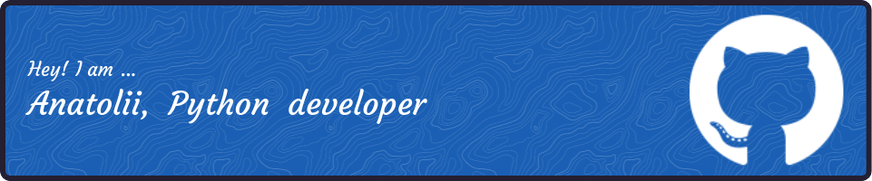

### Hi there ✨✨

<!--
**aerubanov/aerubanov** is a ✨ _special_ ✨ repository because its `README.md` (this file) appears on your GitHub profile.

Here are some ideas to get you started:

- 🔭 I’m currently working on ...
- 🌱 I’m currently learning ...
- 👯 I’m looking to collaborate on ...
- 🤔 I’m looking for help with ...
- 💬 Ask me about ...
- 📫 How to reach me: ...
- 😄 Pronouns: ...
- ⚡ Fun fact: ...
-->
### 
I'm Anatoly, a python developer, working remotely since 2021 🚀
  
  

- 🔭 I’m mainly interested in technologies related to machine learning and data processing 
  

- 🌱I'd like to learn and contribute to open-source technologies
  

- 👨‍🎓 I have some background in material science and engineering -  when I was a phd student, I published several papers about metal additive manufacturing   
  

- ⚡ My favorite sports are running, cycling, and cross-country skiing  
  

   

## I`m working on/learn now
- [AWS course](https://www.udemy.com/course/aws-certified-developer-associate-dva-c01/)
- Neural network for object localization
- Contributing to [pymc](https://github.com/pymc-devs/pymc)

## What I want to learn
- JAX
- AWS sertification
- Sparse Gaussian process regression
- C/C++

## My Skill Set  

 
  

  

  
